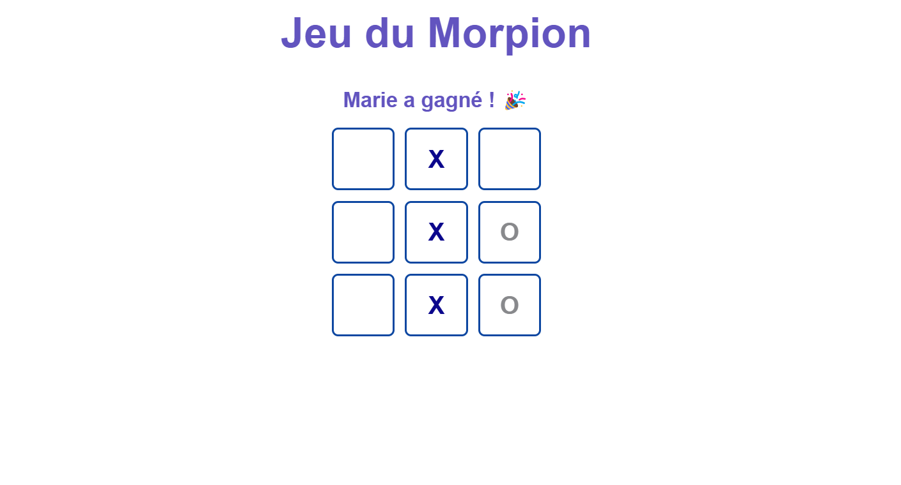

# ❄️ Morpion Hivernal 🎮

Un jeu du **Morpion (Tic-Tac-Toe)** développé en **React.js** avec une ambiance hivernale. Ce projet permet à deux joueurs d’entrer leurs noms et de jouer en alternant les X et O. La case jouée change de couleur :  
🟦 **bleu foncée** pour X  
⚪ **gris métalliquet** pour O  

---

## 📌 Fonctionnalités  
✅ Entrée des noms des joueurs  
✅ Affichage du joueur actuel  
✅ Mise en évidence du gagnant  
✅ Musique de fond pour une immersion hivernale 🎵  
✅ Interface moderne et responsive  

---
## 🛠 Technologies utilisées  
- React.js ⚛️  
- CSS 🎨  
- JavaScript (ES6+)  

## 📸 Aperçu du jeu

